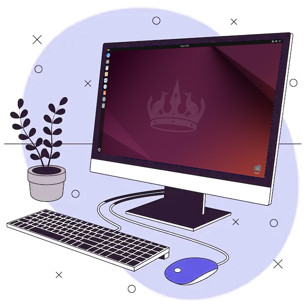

## CyberSec Admin & Tech Enthusiast




<p align="left">

  Hi there! Thank you for checking out my GitHub! ✨

  I sometimes upload projects made to demonstrate concepts used at my job or that were made during college.

  #### Who am I?
  I work in CyberSecurity, which I find pretty neat. I've always loved puzzles, and I do see my job as a big puzzle challange, each one with its unique quirks.

  I like researching security and privacy concepts, and what can be done to better secure a system. There is no perfecly secure system, but I strive to have a good balance between Security, Privacy & Convenience.

</p>

#### My workflow 💻
I try to harness the best of the tools in my field and I try to aways be practical when it comes to my choices. I've used just about every mainstream OS, but I tend to champion Linux systems, because of their flexibility and ease of use.

I use containers which have the main tools of my workflow installed, so I can have a highly reproducible and clean work environment. Security best practices such as 2FA are a must, and compartmentalization of the tools I use further secures my environment.

Here's a quick run-down some of the technologies I've used in various different assignments:

| Ubuntu | Chromium | BurpSuite | VSCode | Android<br/>Studio | GitHub | Docker |
| :---: | :---: | :---: | :---: | :---: | :---: | :---: |
| [](https://ubuntu.com) | [](https://chromium.org/Home) | [](https://portswigger.net/burp) | [](https://code.visualstudio.com/) | [](https://developer.android.com/studio) | [](https://github.com/) | [](https://docker.com/) |

#### Experience & Certifications 🧑🏼‍🎓
###### Networking:
- 
- 
###### System administration:
- -firebrick?logo=redhat)
- -firebrick?logo=redhat)
###### Relevant experiences:
- Bachelor of Computer Science
- I've been working in CyberSecurity for a couple of years now
- Experience with close-to-hardware languages, such as C / C++

#### Languages I speak:
- English
- Portuguese
- I am currently learning German! 🇩🇪
  - Ich spreche nur ein bisschen jetzt, aber Ich lerne schnell! Ich finde Ich lerne gern deustch. 🤓

<!--
#### Contact me

[In-Progress]
-->

##
###### URL Hash (SHA512):
```
c590142a9670232acc9db7207619107f393d476e072833f95afb2e684a17707b1e55fc05ab9403406daf20e1ab180fc6165abe9302e6febe38dcdfa5039f8a98
```

